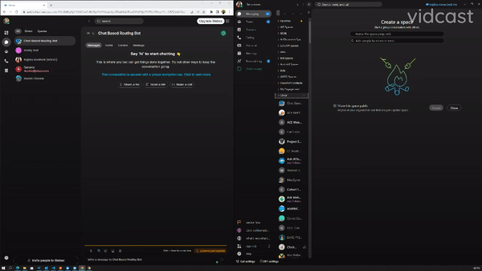

# Chat Based Routing Bot

Welcome to our WXSD DEMO Repo! <!-- Keep this here -->

Chat Based Routing bot helps in connecting the user to a group of experts instantly.

This demo shows how we can use Webex JS SDK and APIs to route users to a space with experts. This demo connects users with experts in various fields to help them resolve issues they may be facing. The app has a user-friendly interface, making it easy for users to find the right expert to solve their problems.

<p align="center">
   <a href="https://app.vidcast.io/share/3ecdac0e-af28-4f30-b0de-50db26aa9143" target="_blank">
       
    </a>
</p>

## Table of Contents

<!-- ⛔️ MD-MAGIC-EXAMPLE:START (TOC:collapse=true&collapseText=Click to expand) -->
<details>
<summary>(click to expand)</summary>
    
  * [Overview](#overview)
  * [Setup](#setup)
  * [Demo](#demo)
  * [License](#license)  
  * [Disclaimer](#disclaimer)
  * [Questions](#questions)

</details>
<!-- ⛔️ MD-MAGIC-EXAMPLE:END -->

## Overview

### Usage

1. User sends a message to the bot cbrouting-globalexpert@webex.bot
2. Fills in required details the bot asks for.
3. Once the user submits the request, the bot creates a room and adds the default members required in that space along with the user who has requested assistance.
4. Once you are done, any moderator of that space can delete the room by mentioning the bot and using the kill command ex:@Chat Based Rouring Bot kill

## Setup

### Prerequisites & Dependencies:

- Valid bot access token. Please refer [Webex Developer Site](https://developer.webex.com/docs/bots#creating-a-webex-bot) to see how to create a bot and access token.
- Developed on Windows 11
- MongoDb (i.e Atlas)
- Node >18.15.0 (recommended)
- Other OS and node versions may work but not tested

You will need to create a file called **.env** that includes the following lines:

```
PORT=
WEBEX_LOG_LEVEL=debug
WEBEX_ACCESS_TOKEN=
MONGO_URI=
MONGO_DB=cbroutingBot

ERROR_ROOM_ID=
```

Note:

1. You will need to provide a port for this to run locally
2. You will need to provide an access_token of a test bot for testing
3. You will need to provide a roomId for error messages to be sent. This can be any Webex Space roomId that your bot is a member of.
4. You can use the Mongo credentials shown above in the .example.env file

<!-- GETTING STARTED -->

### Installation Steps:

The typical npm install flow, after cloning this repo

```
npm install
npm start
```

## Demo

<!-- Insert link to the website below (if deployed) and/or to the YouTube/Vidcast video. -->

Check out our live demo, available [here](https://app.vidcast.io/share/3ecdac0e-af28-4f30-b0de-50db26aa9143)!

<!-- Keep the following statement -->

\*For more demos & PoCs like this, check out our [Webex Labs site](https://collabtoolbox.cisco.com/webex-labs).

## License

All contents are licensed under the MIT license. Please see [license](LICENSE) for details.

## Disclaimer

Everything included is for demo and Proof of Concept purposes only. Use of the site is solely at your own risk. This site may contain links to third party content, which we do not warrant, endorse, or assume liability for. These demos are for Cisco Webex usecases, but are not Official Cisco Webex Branded demos.

## Questions

Please contact the WXSD team at [wxsd@external.cisco.com](mailto:wxsd@external.cisco.com?subject=chat-based-routing-bot) for questions. Or, if you're a Cisco internal employee, reach out to us on the Webex App via our bot (globalexpert@webex.bot). In the "Engagement Type" field, choose the "API/SDK Proof of Concept Integration Development" option to make sure you reach our team.
